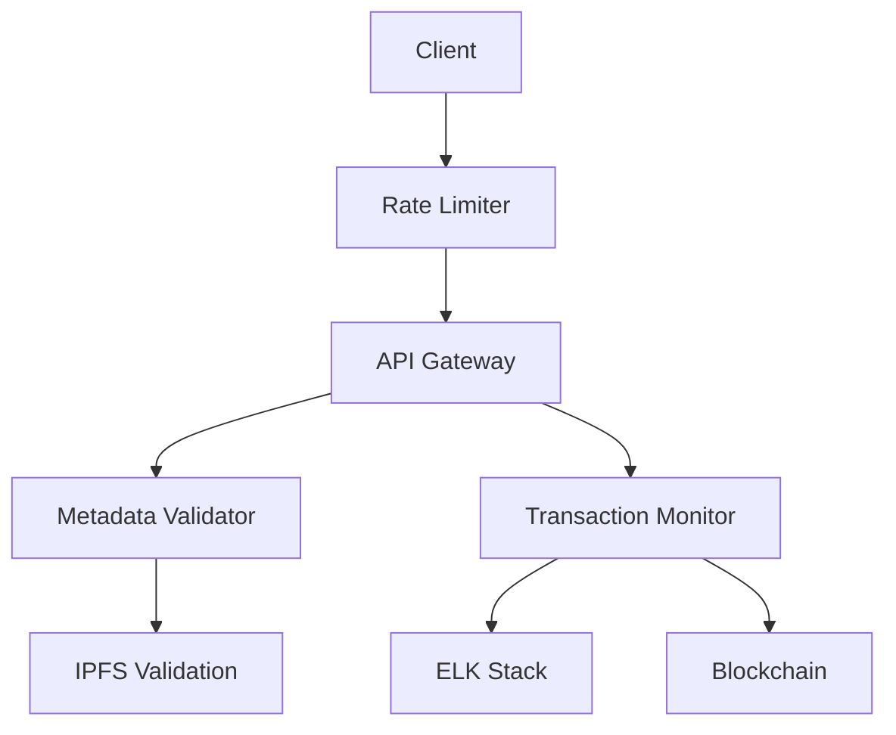
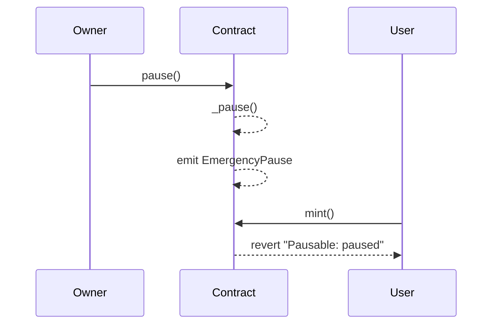
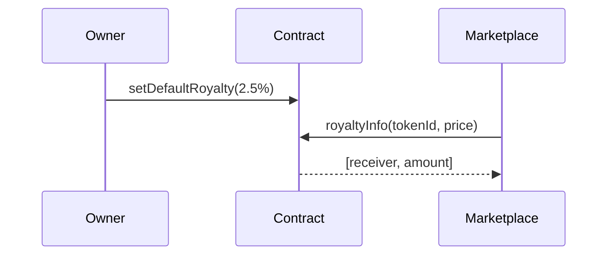
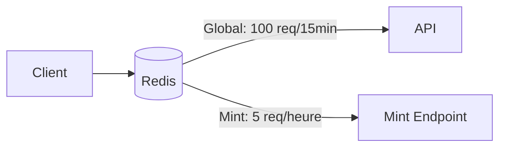
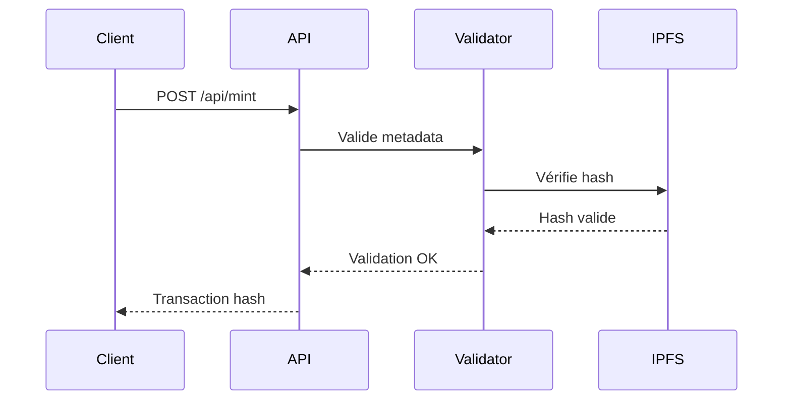
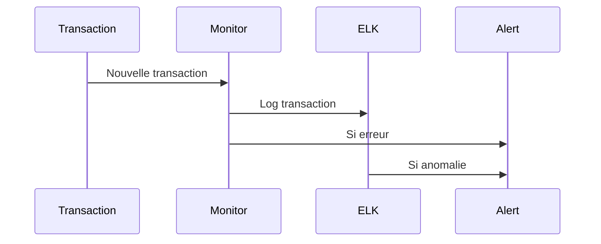

# Documentation Sécurité

## Architecture de Sécurité

## Smart Contract Sécurité

### Mécanisme de Pause

### Système de Royalties

## Rate Limiting

## Validation des Métadonnées

## Monitoring Transactions

## Implémentations

### Smart Contract
- Mécanisme de pause d'urgence
- Standards implémentés :
  - ERC721
  - ERC2981 (Royalties)
- Tests exhaustifs
- Protection contre la réentrance

### Rate Limiting
- Limitation globale : 100 requêtes/15min/IP
- Limitation mint : 5 requêtes/heure/IP
- Stockage Redis distribué
- Protection DDOS basique

### Validation Métadonnées
- Validation champs requis
  - name
  - description
  - image
- Validation format attributs
- Vérification hash IPFS

### Monitoring
- Stack ELK
- Logging temps réel
- Alerting anomalies
- Suivi transactions multi-chain