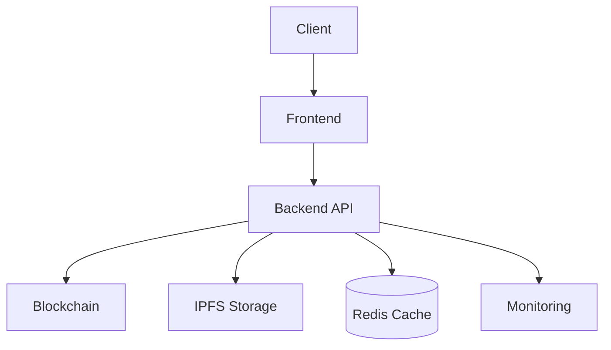

# Documentation Technique

## Architecture Générale



## Smart Contract

### Fonctions d'Urgence
```solidity
// Pause toutes les opérations du contrat
pause() public onlyOwner

// Réactive les opérations du contrat
unpause() public onlyOwner
```

### Events
```solidity
event EmergencyPause(address indexed trigger);
event EmergencyUnpause(address indexed trigger);
```

## Backend Sécurité

### Rate Limiting
```javascript
const mintLimiter = rateLimit({
    windowMs: 60 * 60 * 1000, // 1 heure
    max: 5, // 5 mints par heure
    store: redisStore
});
```

### Validation Métadonnées
```javascript
const validateMetadata = (metadata) => {
    // Vérification des champs requis
    const required = ['name', 'description', 'image'];
    const errors = [];
    
    // Vérification des attributs
    if (metadata.attributes) {
        metadata.attributes.forEach((attr) => {
            if (!attr.trait_type || !attr.value) {
                errors.push('Invalid attribute');
            }
        });
    }
    
    return { valid: errors.length === 0, errors };
};
```

### Monitoring
```javascript
const monitorTransaction = async (txHash, chain) => {
    // Suivi transaction
    const txData = await chain.getTransaction(txHash);
    
    // Logging ELK
    logger.info('Transaction processed', {
        txHash,
        chain,
        status: txData.status
    });
    
    return txData;
};
```

## Frontend

### Configuration
```typescript
const config = {
    SOLANA_NETWORK: 'devnet',
    NFT_STORAGE_KEY: process.env.NFT_STORAGE_KEY,
    PROGRAM_ID: process.env.PROGRAM_ID
}
```

### Intégration Wallet
```typescript
import { useWallet } from '@solana/wallet-adapter-react';
const { wallet, connect } = useWallet();
```

## Sécurité
- Protection contre la réentrance
- Système de pause d'urgence
- Rate limiting distribué
- Validation IPFS
- Monitoring transactions
- Alerting anomalies